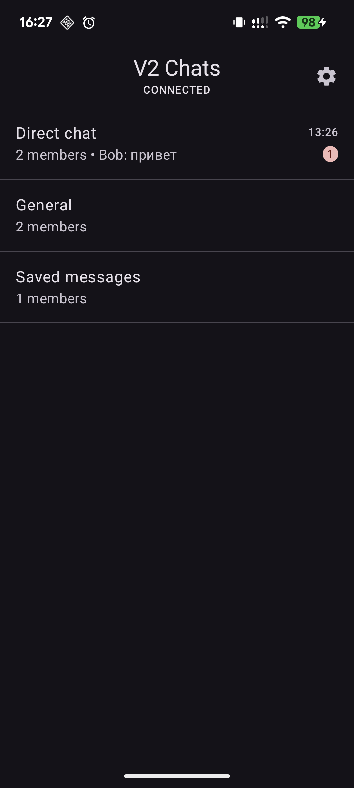
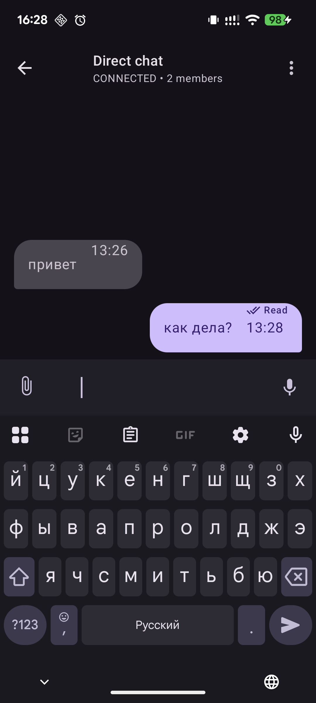
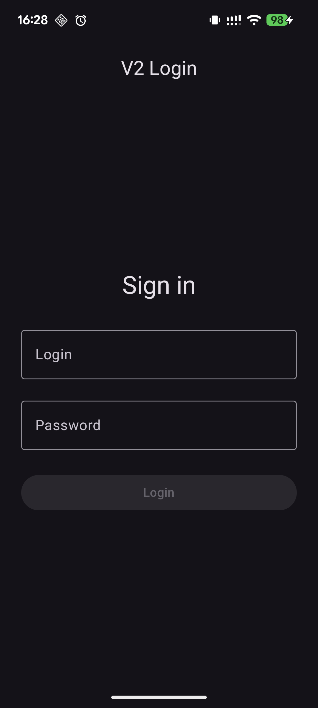

# Kmp-ktor-chat

Мессенджер на Kotlin Multiplatform.

Проект сделан как попытка собрать свое приложение для переписки с общей логикой для разных платформ.

Сейчас проект находится в активной разработке. Одна из целей проекта — не только сделать рабочее приложение, но и лучше понять, как устроены чаты и мессенджеры изнутри.

## Что сделано

Сейчас в проекте работает:

- авторизация
- список чатов
- экран переписки
- отправка и получение сообщений
- typing status
- read / unread состояние
- unread badge для чатов
- переподключение к сокету
- Android и Desktop версии

## Скриншоты

Здесь потом будут скриншоты приложения.

<div>
  
  
  
</div>

## Сборка

### Android

```sh
./gradlew :composeApp:assembleDebug
```

### Desktop

```sh
./gradlew :composeApp:run
```

## Отдельно

При работе над проектом я обращался к:
- Jetchat — оттуда я брал UI: https://github.com/android/compose-samples/tree/main/Jetchat
- Stream Chat Android SDK — оттуда я ориентировался на структуру: https://github.com/GetStream/stream-chat-android
